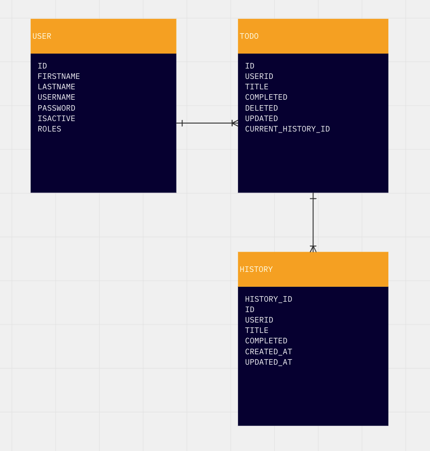
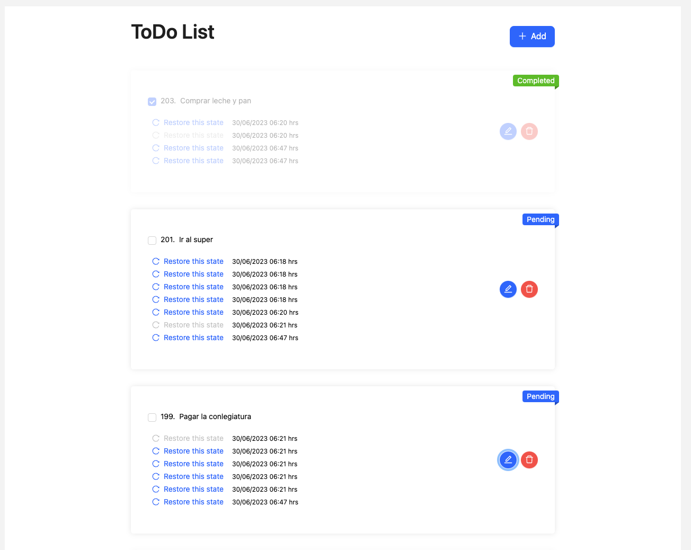
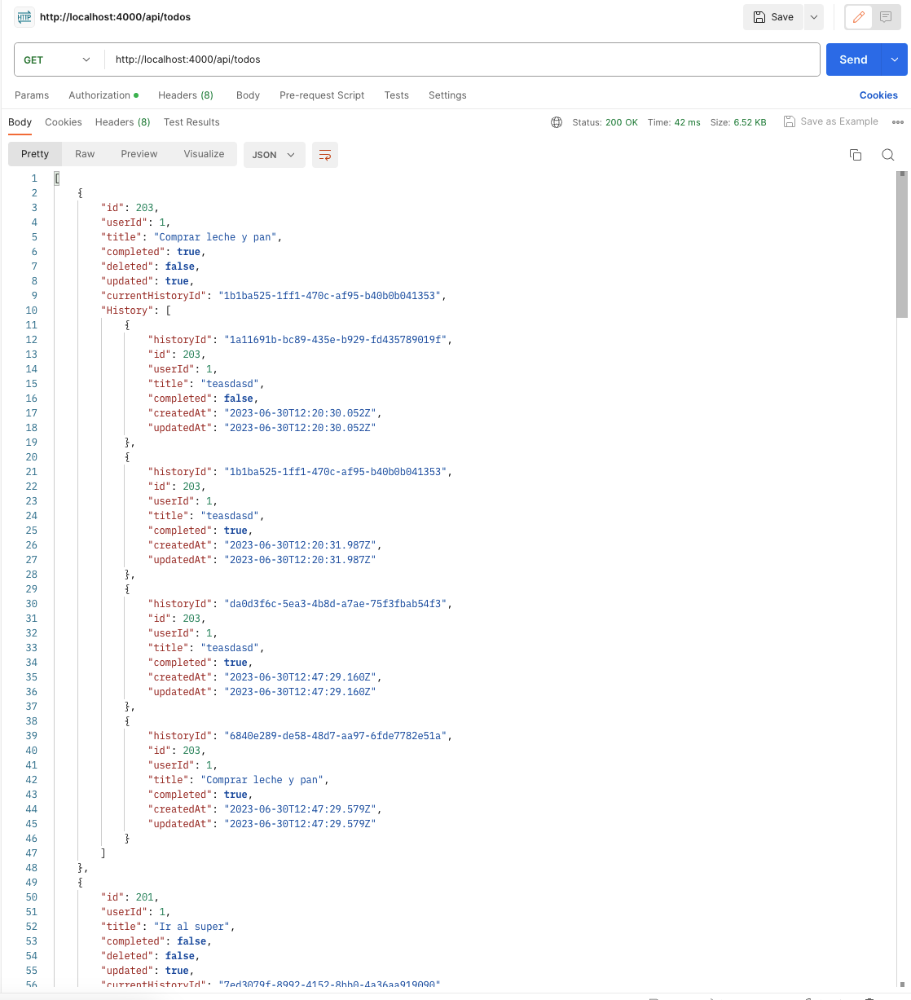

# S2credit Full Stack Web App

## Descripción

Este proyecto es una aplicación web que demuestra el consumo de servicios Rest para presentación y manipulación (CRUD).

## Tecnologías

Debido al corto tiempo de desarrollo, se decidió utilizar las siguientes tecnologías para agilizar el desarrollo:

- [Node.js](https://nodejs.org/es/)
- [NestJS](https://nestjs.com/)
- [React](https://es.reactjs.org/)
- [Prisma](https://www.prisma.io/)
- [Docker](https://www.docker.com/)
- [PostgreSQL](https://www.postgresql.org/)
- [TypeScript](https://www.typescriptlang.org/)
- [Ant Design](https://ant.design/)

## Instalación

Para asegurar el correcto funcionamiento de la aplicación, se decidió utilizar un contenedor de Docker, por lo que se debe tener instalado Docker en el equipo donde se desplegará la aplicación.

### Docker

Desde la raíz del proyecto, ejecutar el siguiente comando:

```bash
docker-compose up -d
```

### Base de datos



La base de datos se encuentra en un contenedor de Docker, por lo que no es necesario instalarla en el equipo local.

Para poder generar el usuario de prueba, se debe ejecutar el siguiente script:

```bash
npm run prisma:seed
```

## Uso

Para acceder al backend de la aplicación, se debe ingresar a la siguiente URL:

```bash
http://localhost:4000/api
```

### TODOs Endpoints

- `GET /todos` - Obtiene todos los TODOs
- `POST /todos` - Crea un TODO
- `PATCH /todos/:id` - Actualiza un TODO
- `POST /todos/restore/:id` - Restaura un TODO a un estado anterior

### Users Endpoints

- `POST /register` - Crea un usuario nuevo, el username debe ser único y posteriormente la contraseña se encripta utilizando un algoritmo de MD5
- `POST /login` - Inicia sesión

Para acceder al frontend de la aplicación, se debe ingresar a la siguiente URL:

```bash
http://localhost:5173
```

Las credenciales de acceso son, como especifica el enunciado del ejercicio:

- Usuario: `s2credit`
- Contraseña: `s2creditJosé`

## Demostración

### Frontend



### Backend


